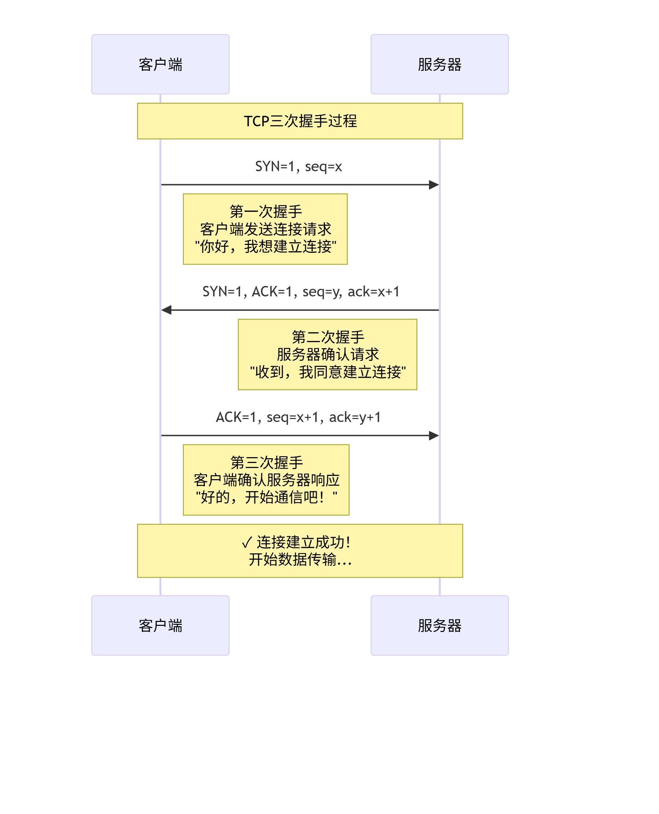

# 网络基础（TCP/IP协议、三次握手、端口概念）

## 1. 网络基础讲解
### 核心概念

**TCP/IP协议族**是互联网通信的基础，就像现实世界的**邮政系统**一样，负责数据的可靠传输。

**TCP/IP四层模型**（类比快递系统）：
- 应用层 - 你的信件内容（HTTP、FTP、SMTP）
- 传输层 - 快递包装和物流单（TCP、UDP）
- 网络层 - 地址和路由（IP协议）
- 网络接口层 - 运输工具（以太网、WiFi）

**TCP vs UDP 核心区别**：

1. TCP - 可靠传输，像打电话
   - 需要建立连接（三次握手）
   - 保证数据顺序和完整性
   - 自动重传丢失的数据
   - 适合：网页浏览、文件传输、邮件

2. UDP - 不可靠传输，像发短信
   - 无需建立连接
   - 不保证数据到达顺序
   - 可能丢失数据包
   - 适合：视频流、游戏、DNS查询


### 三次握手详解

**TCP连接建立过程** - 就像确认双方都能正常沟通：



**为什么需要三次握手？**
- **防止历史连接**：避免网络延迟导致的重复连接请求
- **同步序列号**：确保双方都知道对方的起始序号
- **确认双向可达**：证明客户端和服务器都能正常收发数据

PS: **TCP四次挥手**

### 端口概念与应用

**端口的作用** - 就像公司的分机号，员工号：
- 80:  HTTP - 网页浏览
- 443:  HTTPS - 安全网页
- 22:   SSH - 安全远程登录
- 53:   DNS - 域名解析
- 3306: MySQL - 数据库
- 5432: PostgreSQL - 数据库
- 6379: Redis - 缓存数据库

## 2. 应用场景
### 互联网后时代+人工智能时代，网络无处不在！

## 3. 编程实例

**聊天室服务器架构**：

```go
package main

import (
    "fmt"
    "net"
    "sync"
)

type ChatRoom struct {
    clients map[net.Conn]string
    mutex   sync.RWMutex
}

func NewChatRoom() *ChatRoom {
    return &ChatRoom{
        clients: make(map[net.Conn]string),
    }
}

func (cr *ChatRoom) broadcast(sender net.Conn, message string) {
    cr.mutex.RLock()
    defer cr.mutex.RUnlock()
    
    for client := range cr.clients {
        if client != sender {
            client.Write([]byte(message))
        }
    }
}

func (cr *ChatRoom) handleConnection(conn net.Conn) {
    defer conn.Close()
    
    // 获取用户名
    conn.Write([]byte("请输入你的用户名: "))
    buffer := make([]byte, 1024)
    n, _ := conn.Read(buffer)
    username := string(buffer[:n-1]) // 去掉换行符
    
    // 注册用户
    cr.mutex.Lock()
    cr.clients[conn] = username
    cr.mutex.Unlock()
    
    // 广播用户加入
    cr.broadcast(conn, fmt.Sprintf("系统: %s 加入了聊天室\n", username))
    
    for {
        n, err := conn.Read(buffer)
        if err != nil {
            break
        }
        
        message := string(buffer[:n])
        if message == "/quit\n" {
            break
        }
        
        // 广播消息
        fullMessage := fmt.Sprintf("%s: %s", username, message)
        cr.broadcast(conn, fullMessage)
    }
    
    // 用户退出
    cr.mutex.Lock()
    delete(cr.clients, conn)
    cr.mutex.Unlock()
    cr.broadcast(conn, fmt.Sprintf("系统: %s 离开了聊天室\n", username))
}

func main() {
    chatRoom := NewChatRoom()
    
    listener, err := net.Listen("tcp", ":8888")
    if err != nil {
        fmt.Println("启动服务器失败:", err)
        return
    }
    defer listener.Close()
    
    fmt.Println("聊天室服务器启动在 :8888 端口...")
    
    for {
        conn, err := listener.Accept()
        if err != nil {
            fmt.Println("接受连接失败:", err)
            continue
        }
        
        go chatRoom.handleConnection(conn)
    }
}
```

## 4. 课时总结
- **理解这些抽象的概念，对后面的项目开发很有必要**
- **TCP/IP协议族**：互联网通信的基础，分为四层模型
- **TCP vs UDP**：TCP可靠如打电话，UDP快速如发短信
- **三次握手**：确保连接可靠建立的必要过程
- **端口概念**：区分不同网络服务的"门牌号"
