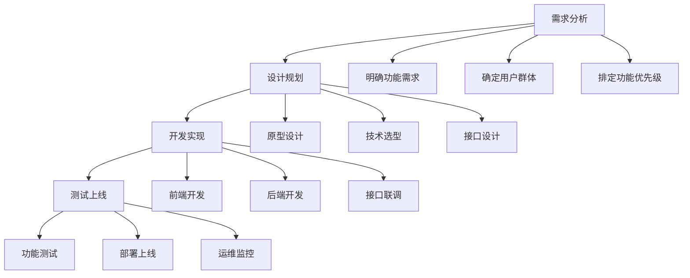

# Web开发流程：从想法到上线的完整过程

## 为什么需要开发流程？
就像盖房子需要先画图纸一样，开发Web系统也需要规范的步骤，避免混乱和返工。

## 开发流程的四个主要阶段

### 阶段一：需求分析（搞清楚要做什么）
**参与角色**：产品经理、客户、开发团队

**做什么**：
- 与客户沟通，了解想要什么功能
- 分析目标用户和使用场景
- 列出所有功能点并排优先级

**为什么**：避免开发过程中不断修改需求，确保大家目标一致

### 阶段二：设计规划（规划怎么做）
**参与角色**：产品经理，UI设计师、架构师、开发负责人

**做什么**：
- **原型设计**：画出页面大概样子，有基本的元素和交互
- **技术选型**：选择用什么技术开发，进行服务架构和技术方案设计
- **数据库设计**：设计数据存储结构，
- **接口设计**：定义前后端如何通信

**为什么**：提前发现问题，统一团队认知，减少开发中的不确定因素

### 阶段三：开发实现（动手编码）
**参与角色**：前端工程师、后端工程师

**做什么**：
- **前后端分离开发**：
  - 前端：做页面展示和用户交互
  - 后端：提供数据接口和业务逻辑
- 两边按照约定好的接口并行开发
- 定期联调测试

**为什么**：提高开发效率，前后端可以同时工作

### 阶段四：测试上线（确保质量并发布）
**参与角色**：测试工程师、运维工程师

**做什么**：

- **测试**：检查功能是否正常，有没有bug
- **部署**：将产物放到服务器上让用户访问
- **监控**：观察系统运行状态

**为什么**：保证系统稳定可靠，用户体验良好，SLA

## 核心要点
1. **按步骤来**：不要跳过任何阶段
   1. 一旦跳过任何一个流程的各个节点信息就会失真，进入混乱状态
   2. 最终的后果一定会是嘴说了算，质量堪忧，加班无终点
2. **沟通协作**：团队各角色要密切配合，即使沟通并做好记录  
3. **文档重要**：写好需求文档和接口文档，既是一种约定，也是知识资产的沉淀
4. **用户至上**：始终考虑数据安全，始终考虑用户体验
