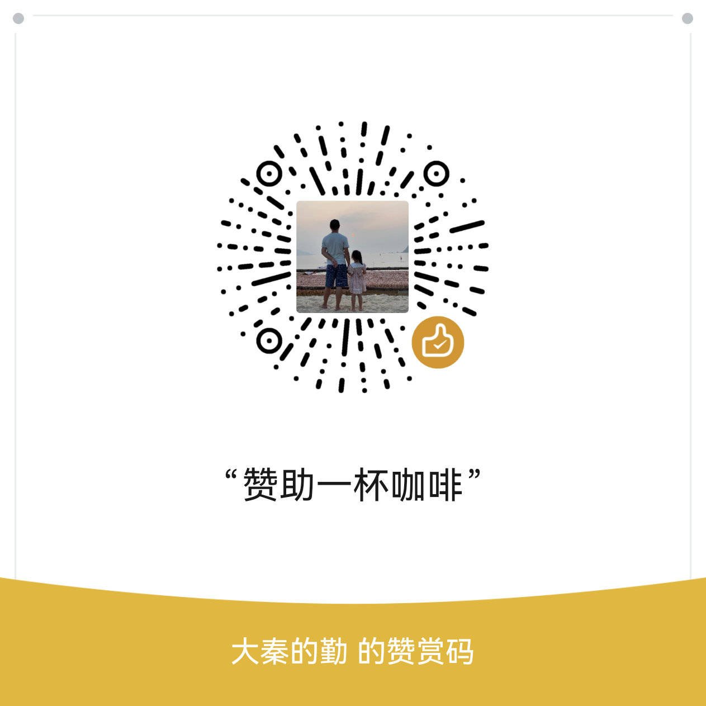

## github仓库
- https://github.com/yuanqinguo/flyfei/tree/master
## 课程介绍
- [课程介绍](intro/1-课程介绍.md)
- [课程大纲](intro/2-go教学课程大纲.md)

## 入门基础
### go基础语法
- [1. 环境搭建](base/1.环境搭建.md)
- [2. 变量、常量、数据类型](base/2.变量、常量、数据类型.md)
- [3. 运算符和表达式优先级](base/3.运算符和表达式优先级.md)
- [4. 流程控制](base/4.流程控制.md)
- [5. 函数](base/5.函数.md)
- [6. 指针](base/6.指针.md)
- [7. 错误处理](base/7.错误处理.md)

### go语言数据结构与算法包
- [8. 数组与切片](base/8.数组与切片.md)
- [9. 映射-map](base/9.map-映射.md)
- [10. sort包使用](base/10.sort包使用.md)
### Go语言面向对象编程
- [11. 结构体](base/11.结构体.md)
- [12. 方法](base/12.方法.md)
- [13. 接口](base/13.接口.md)
- [14. go的'面向对象'](base/14.go的-面向对象.md)
- [15. go的包与导入](base/15.go的包与导入.md)

### Go语言标准库与工具链
- [16. 常用标准库.md](base/16.常用标准库.md)
- [17. 字符串处理](base/17.字符串处理.md)
- [18. 时间与日期处理](base/18.时间与日期处理.md)
- [19. 反射](base/19.反射.md)
- [20. 泛型](base/20.泛型.md)
- [21. Go工具链介绍](base/21.Go工具链介绍.md)
- [22. 调试分析工具](base/22.调试分析工具.md)

## 进阶应用
### Go语言并发编程
#### Go语言并发编程
- [1. 并发模型](advance/1.并发模型.md)
- [2. chan-管道](advance/2.chan-管道.md)
- [3. 同步原语](advance/3.同步原语.md)
- [4. 并发模式](advance/4.并发模式.md)
#### Go语言网络编程
- [5. TCP-IP网络基础](advance/5.TCP-IP网络基础.md)
- [6. Http编程](advance/6.http编程.md)
- [7. websocket编程](advance/7.websocket编程.md)

#### Go语言Web开发基础
- [8. Web开发流程](advance/8.web开发流程.md)
- [9. 路由系统](advance/9.路由系统.md)
- [10. 中间件](advance/10.中间件.md)
- [11. RESTfulAPI](advance/11.RESTful-API设计.md)

## 企业级项目实战
- [1. 产品需求分析](project/1.产品需求.md)
- [2. 技术方案文档框架](project/2.技术文档框架.md)
- [3. Mysql简单使用](project/3.mysql选型简单使用.md)
- [4. Git协作流程简单使用](project/4.Git协作流程简单使用.md)
- [5. 服务配置和环境变量](project/5.服务配置和环境变量.md)

## 项目后续说明
1. 感谢各位同学的参与和支持，后续的技术方案文档，项目管理文档等，多少都会涉及一些图片， 在github上公开的话，画图以后需要各种截图然后对应文件名等等，不是很方便，之后都会用飞书文档来写
2. 实战项目的代码框架均已完成，后续只需进行功能增加和迭代即可, 涉及各类业务逻辑实现代码，会在CNB上进行公开，并分成两个项目来实现：**edu.mall.backend   edu.mall.frontend**， 前端代码因本人前端技能有限，实现太丑，就不公开了
3. 写代码过程会不可避免会有调整,为节省各位看课学习的时间，大秦都会对代码进行提前写优化后，再删除重录课程，所以视频还没来得及录，后续大秦会补充B站课程对应到代码框架的视频，并在2025年11月30之前进行补录到B站
4. **后续视频会继续在B站**更新，有需要项目完整文档和后端项目的同学，可以关注 “大秦说AI”或加V联系大秦获取
>微信号： qingflyfei
  
5. 本项目在B站视频更新完后，会正式发布到生产，预计在2026年新年来临之前，可以跟大家见面

## 最后
> 谢谢大家的喜欢和关注，如果项目和课程对您有价值，赞助一杯咖啡给大秦吧，大秦会在后续项目正式上线后，用一个专区展示赞助过大秦的朋友，谢谢大家！

