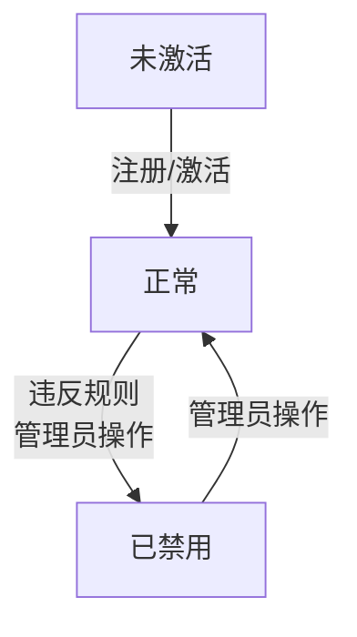
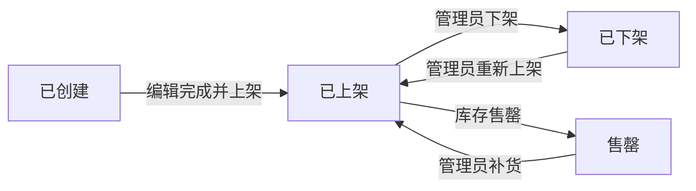
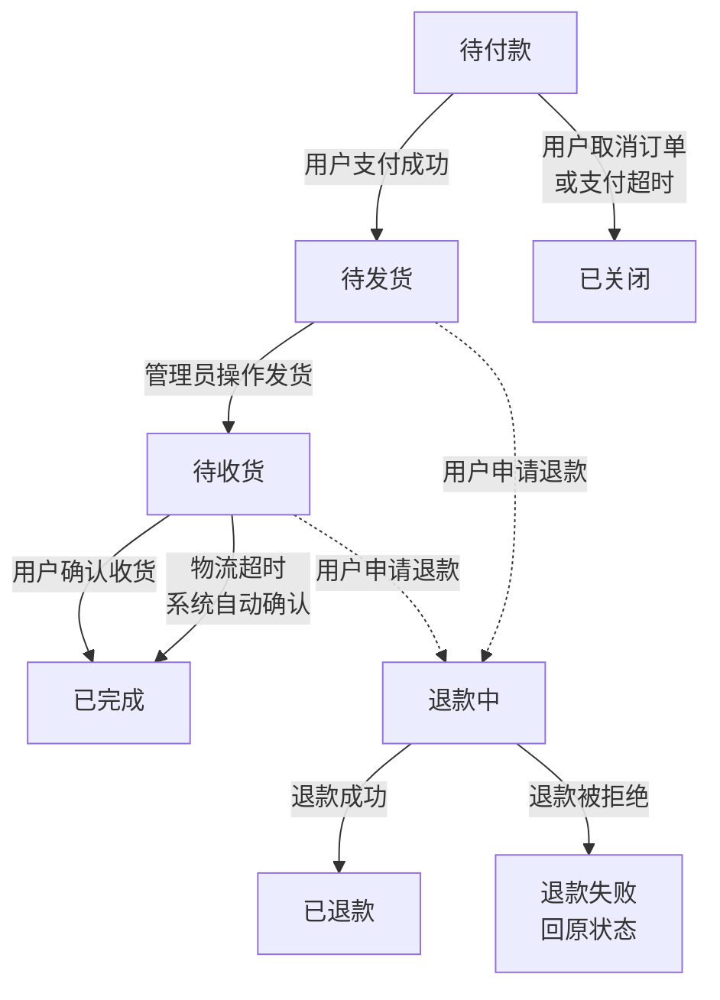
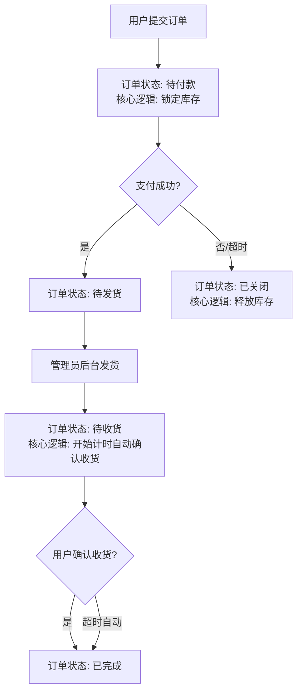

# V1.0产品需求文档

**文档版本:** 1.0
**创建日期:** 2025-11-02
**产品经理:** [大秦]

---

## 1. 文档概述

### 1.1 产品简介
本产品是一个最小可行性的B2C在线商城系统，核心目标是让用户能够完成从商品浏览到下单支付的完整线上购物流程。系统分为**用户前台**和**管理后台**两部分。

### 1.2 项目目标
* **用户侧：** 提供清晰、流畅的商品浏览和购买体验。
* **运营侧：** 提供最基本的商品、订单和用户管理能力。

### 1.3 范围界定
* **本次版本包含：** 商品展示、购物车、订单流程、在线支付、用户注册登录、基础后台管理。
* **本次版本不包含：** 优惠券/促销活动、商品评价/问答、分销/代理、物流跟踪API集成、会员等级、库存预警等功能。

---

## 2. 用户角色

| 角色           | 描述               | 核心诉求                           |
| :------------- | :----------------- | :--------------------------------- |
| **游客**       | 未登录的访问用户   | 浏览商品，了解信息                 |
| **注册用户**   | 已注册并登录的用户 | 购买商品，管理自己的订单和收货地址 |
| **系统管理员** | 后台管理用户       | 管理整个商城的商品、订单和用户数据 |

---

## 3. 核心对象状态定义与流转

### 3.1 用户状态
用户状态主要围绕其账户的可用性。

**状态说明：**
* **未激活：** 新注册用户，尚未通过邮箱/手机验证（如果系统要求验证）。
* **正常：** 账户可正常使用，可以浏览、下单、支付。
* **已禁用：** 账户因违规等原因被管理员封禁。**逻辑：** 禁止登录，所有需要登录身份的操作均被拦截。

### 3.2 商品状态
商品状态决定了其在前台的可见性与可销售性。

**状态说明：**
* **已创建：** 在后台新建了商品信息，但尚未填写完整或未执行上架操作。**逻辑：** 前台不可见。
* **已上架：** 商品信息完善且已发布。**逻辑：** 前台可见，可被购买。
* **已下架：** 管理员主动将商品撤下。**逻辑：** 前台不可见，已存在于用户购物车中的该商品，在结算时需提示"商品已下架"并禁止购买。
* **售罄：** 商品库存为0时自动进入此状态。**逻辑：** 前台可见但显示无货，购买按钮置灰。

### 3.3 订单状态与流转
这是系统最复杂的状态机，它清晰地描述了购物流程的每一个环节。

**状态详情与逻辑：**

* **待付款：**
  * **生成：** 用户提交订单后。
  * **逻辑：** 系统会锁定并扣减相应商品的库存，防止超卖。
  * **流向：**
    * → **待发货**：用户支付成功。
    * → **已关闭**：用户主动取消，或系统在指定时间（如30分钟）后因超时未支付自动取消。**取消后需恢复商品库存**。

* **待发货：**
  * **生成：** 支付成功。
  * **逻辑：** 等待管理员处理订单，进行打包、发货操作。
  * **流向：**
    * → **待收货**：管理员填写物流单号，点击"发货"。

* **待收货：**
  * **生成：** 管理员发货后。
  * **逻辑：** 用户可以查看物流信息。此状态开始计算自动确认收货时间（如发货后10天）。
  * **流向：**
    * → **已完成**：用户主动点击"确认收货"，或系统超时自动确认。

* **已完成：**
  * **生成：** 用户确认收货。
  * **逻辑：** 订单生命周期的终结。资金可结算给商家。

* **已关闭：**
  * **生成：** 待付款状态下被取消。
  * **逻辑：** 订单终结。

**售后相关状态：**

* **退款中：** 用户提交退款申请。
* **已退款：** 管理员审核通过，款项已退回。
* **退款失败：** 管理员审核拒绝，订单返回至"待发货"或"待收货"状态。

---

## 4. 功能需求详情

### 4.1 用户前台功能

#### 4.1.1 用户模块
* **注册：**
  * 字段：手机号/邮箱、密码、确认密码、验证码。
  * 业务逻辑：密码需加密存储。注册成功后自动登录，用户状态变为"正常"。
* **登录：**
  * 方式：手机号/邮箱 + 密码。
  * 业务逻辑：登录成功后，同步用户的购物车数据（如存在）。检查用户状态，如为"已禁用"则拒绝登录。
* **登出：**
  * 清除登录状态。

#### 4.1.2 商品模块
* **首页：**
  * 展示商品分类导航栏。
  * 以列表或网格形式展示部分推荐商品（仅显示"已上架"且非"售罄"的商品）。
* **商品列表页：**
  * 按分类筛选商品（仅显示"已上架"商品）。
  * 支持按价格、上架时间等进行简单排序。
  * 商品信息：主图、名称、价格。
* **商品详情页：**
  * 核心信息：商品名称、主图/多图、价格、库存、商品描述。
  * 功能按钮："加入购物车"、"立即购买"。
  * 业务逻辑：库存为0或商品状态为"已下架"时，按钮置灰或显示"无货"。

#### 4.1.3 购物车模块
* **查看购物车：**
  * 展示用户添加的所有商品。
  * 信息：商品、单价、数量、小计、总金额。
* **管理购物车：**
  * 可修改商品数量（不能超过库存）。
  * 可删除单件或多件商品。
  * 可勾选需要结算的商品。
* **去结算：**
  * 业务逻辑：结算前校验商品状态，如商品已下架或库存不足，需提示用户并禁止结算。
  * 跳转到订单确认页。

#### 4.1.4 订单模块
* **订单确认页：**
  * 选择/管理收货地址（新增、编辑、删除）。
  * 确认购买的商品清单和数量。
  * 显示订单总金额。
* **提交订单：**
  * 业务逻辑：
    1. 再次校验库存和商品状态。
    2. 扣减商品库存，生成"待付款"订单。
    3. 跳转到支付页面。
* **订单列表页：**
  * 展示用户的所有订单，按状态（待付款、待发货、待收货、已完成）筛选。
* **订单详情页：**
  * 展示订单的完整信息：商品、价格、收货地址、物流单号等。
* **订单操作：**
  * 待付款订单：可"去支付"或"取消订单"（订单状态变为"已关闭"，恢复库存）。
  * 待收货订单：可"确认收货"（订单状态变为"已完成"）。

#### 4.1.5 支付模块
* **发起支付：**
  * 在订单确认页提交后，跳转到支付页。
  * 为了简化，可集成支付宝/微信支付的沙箱环境进行演示。
* **支付回调：**
  * 业务逻辑：收到支付成功通知后，将订单状态从"待付款"更新为"待发货"。

### 4.2 管理后台功能

#### 4.2.1 商品管理
* **商品列表：** 查看、搜索、上下架商品（控制商品在"已上架"/"已下架"状态间切换）。
* **新增/编辑商品：**
  * 字段：商品名称、分类、价格、库存、主图、详情图/文。
  * 新建商品默认状态为"已创建"，上架后变为"已上架"。
* **商品分类管理：**
  * 支持一级分类的增、删、改、查。

#### 4.2.2 订单管理
* **订单列表：** 查看所有订单，可按状态、订单号等搜索。
* **订单详情：** 查看订单完整信息。
* **订单操作：**
  * 对"待发货"订单，可进行"发货"操作（填写物流公司、物流单号），操作后订单状态变为"待收货"。
  * 可手动修改订单状态（如处理退款等特殊情况）。

#### 4.2.3 用户管理
* **用户列表：** 查看注册用户列表，可禁用/启用账户（控制用户在"正常"/"已禁用"状态间切换）。

---

## 5. 核心业务逻辑流程图

### 5.1 用户下单支付流程（状态视角）

### 5.2 后台订单处理流程

---

## 6. 非功能性需求

* **性能：** 页面加载时间应在3秒内。
* **安全性：** 用户密码需加密，支付接口需使用HTTPS，防止SQL注入和XSS攻击。
* **兼容性：** 前台网站需兼容Chrome, Firefox, Safari等主流浏览器。

---

## 7. 数据统计（后台）

为管理员提供最基础的数据看板：
* 总用户数（按状态统计）
* 总订单数（按状态统计）
* 总销售额
* 今日订单数/销售额
* 商品销量排行
