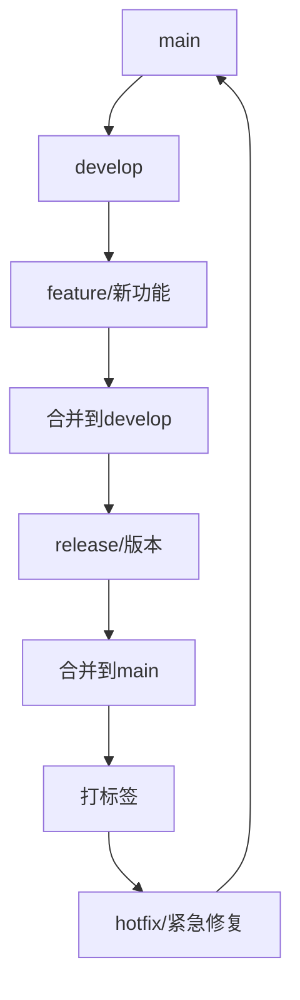

# Git协作流程与方法

## 第一部分：Git基础概念

### 1.1 为什么需要版本控制？
- **个人开发**：代码备份、版本回退、修改追踪
- **团队协作**：避免代码冲突、分工合作、代码审查
- **项目管理**：版本发布、bug追踪、功能管理

### 1.2 Git是什么？
```bash
# Git是一个分布式版本控制系统
# 与SVN等集中式系统的区别：
# - 每个开发者都有完整的代码仓库
# - 不依赖网络即可提交代码
# - 更强大的分支管理能力
```

---

## 第二部分：Git基础操作

### 2.1 安装与配置
```bash
# 安装Git
# Windows: 下载Git Bash
# Mac: brew install git
# Linux: sudo apt install git

# 基础配置
git config --global user.name "你的姓名"
git config --global user.email "你的邮箱"
git config --global init.defaultBranch main
```

### 2.2 基础工作流程
```
工作区 → 暂存区 → 本地仓库 → 远程仓库
  ↓        ↓         ↓         ↓
修改文件 → git add → git commit → git push
```

### 2.3 常用命令速查
```bash
# 初始化仓库
git init

# 克隆远程仓库
git clone <仓库地址>

# 查看状态
git status

# 添加文件到暂存区
git add <文件名>        # 添加特定文件
git add .              # 添加所有文件

# 提交更改
git commit -m "提交说明"

# 推送到远程仓库
git push origin main

# 拉取最新代码
git pull origin main

# 查看提交历史
git log
```

---

## 第三部分：分支管理策略

### 3.1 为什么需要分支？
- 并行开发多个功能
- 隔离开发环境
- 便于代码审查
- 降低主分支风险

### 3.2 常用分支类型
```
main/master    - 主分支，稳定版本
develop        - 开发分支，集成功能
feature/*      - 功能分支
hotfix/*       - 紧急修复分支
release/*      - 发布分支
```

### 3.3 分支操作命令
```bash
# 查看分支
git branch              # 本地分支
git branch -r           # 远程分支
git branch -a           # 所有分支

# 创建分支
git branch feature/user-login
git checkout -b feature/user-login  # 创建并切换

# 切换分支
git checkout main
git switch main         # 新版本推荐

# 合并分支
git checkout main
git merge feature/user-login

# 删除分支
git branch -d feature/user-login    # 本地删除
git push origin --delete feature/user-login  # 远程删除
```

---

## 第四部分：团队协作流程

### 4.1 标准协作流程（Git Flow）


### 4.2 简化流程
```
1. 从main分支创建功能分支
2. 在功能分支上开发
3. 定期同步main分支更新
4. 完成功能后创建Pull Request
5. 代码审查
6. 合并到main分支
```

### 4.3 具体操作步骤
```bash
# 1. 获取最新代码
git checkout main
git pull origin main

# 2. 创建功能分支
git checkout -b feature/add-user-auth

# 3. 开发功能，定期提交
git add .
git commit -m "feat: 添加用户认证功能"

# 4. 推送到远程
git push origin feature/add-user-auth

# 5. 在GitHub/GitLab创建Pull Request
# 6. 等待代码审查和合并
```

---

## 第五部分：项目中的Git实践

### 5.1 .gitignore文件配置
```gitignore
# Go语言相关
bin/
pkg/
*.exe
*.test

# 依赖管理
vendor/

# 编辑器文件
.vscode/
.idea/
*.swp
*.swo

# 系统文件
.DS_Store
Thumbs.db
```

### 5.2 提交信息规范
```bash
# 格式：类型(范围): 描述

# 示例：
git commit -m "feat(auth): 添加JWT认证功能"
git commit -m "fix(user): 修复用户注册bug"
git commit -m "docs: 更新API文档"
git commit -m "test: 添加用户服务测试"

# 常用类型：
# feat: 新功能
# fix: bug修复
# docs: 文档更新
# style: 代码格式调整
# refactor: 重构
# test: 测试相关
# chore: 构建过程或辅助工具变动
```

---

## 第六部分：解决常见问题

### 6.1 代码冲突解决
```bash
# 当git pull出现冲突时：
1. 打开冲突文件，搜索 <<<<<<< 
2. 手动解决冲突，保留需要的代码
3. 删除冲突标记 <<<<<<<, =======, >>>>>>>
4. 重新提交
git add .
git commit -m "fix: 解决合并冲突"
git push
```

### 6.2 撤销操作
```bash
# 撤销工作区修改
git checkout -- <文件名>

# 撤销暂存区文件
git reset HEAD <文件名>

# 撤销最近提交
git reset --soft HEAD^   # 保留修改
git reset --hard HEAD^   # 丢弃修改

# 注意：谨慎使用--hard，会丢失代码！
```

### 6.3 紧急bug修复
```bash
# 1. 从main创建hotfix分支
git checkout -b hotfix/critical-bug

# 2. 修复bug并提交
git add .
git commit -m "fix: 紧急修复安全漏洞"

# 3. 合并到main和develop
git checkout main
git merge hotfix/critical-bug

git checkout develop
git merge hotfix/critical-bug

# 4. 删除hotfix分支
git branch -d hotfix/critical-bug
```

**Git是一个工具，熟练使用需要实践。多动手、多犯错、多总结！**

### 6.4  Goland中的git工具使用，看视频演示